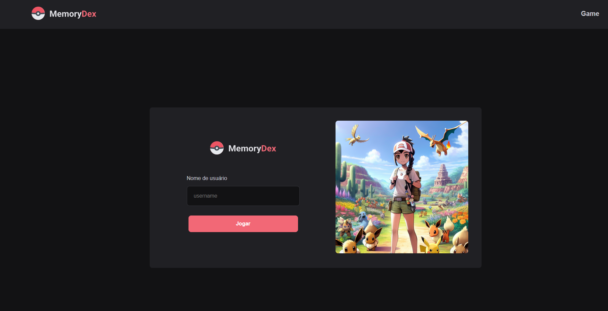
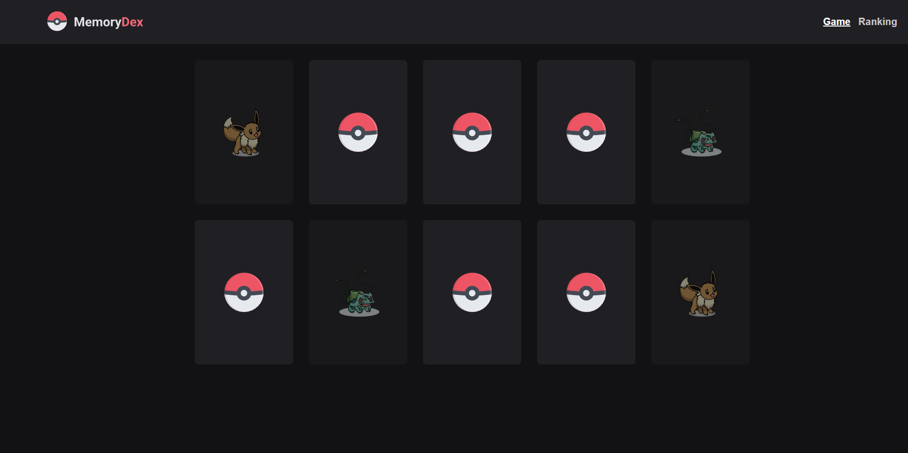
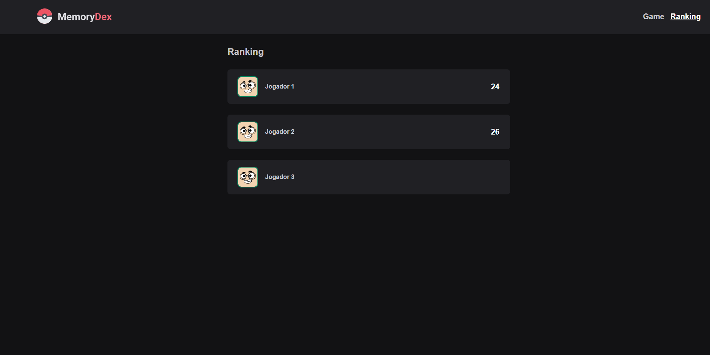

# Memoridex - Jogo da Memória com Pokémon

## Descrição do Projeto

**Memoridex** é um jogo de memória baseado em Pokémon, onde os jogadores devem combinar pares de cartas com imagens de Pokémon. O jogo registra o número de passos que o jogador leva para completar o jogo e exibe os resultados em um ranking. O jogo foi desenvolvido utilizando React, JavaScript e CSS.

## Capturas de Tela

### Página Inicial


### Página do Jogo


### Página de Ranking


## Funcionalidades

- **Jogo da Memória:** Combine pares de cartas com Pokémon.
- **Contagem de Passos:** O número de movimentos que o jogador realiza é registrado.
- **Ranking:** Após terminar o jogo, o jogador pode visualizar sua posição no ranking.
- **Login de Usuário:** Os jogadores precisam se autenticar para acessar o jogo.
- **Responsividade:** O jogo é totalmente responsivo e pode ser jogado em dispositivos móveis e desktops.

## Tecnologias Utilizadas

- **React**: Biblioteca JavaScript para construção de interfaces de usuário.
- **React Router**: Gerenciamento de rotas para navegação no jogo.
- **CSS Modules**: Estilização modular e escopo local.
- **LocalStorage**: Armazenamento local para registrar os resultados do jogo.

## Pré-requisitos

Antes de começar, você precisará ter o seguinte software instalado:

- **Node.js** (v14 ou superior)
- **npm** (ou **yarn**)

## Como Rodar o Projeto

Siga os passos abaixo para rodar o projeto localmente:

### 1. Clone o Repositório

```bash
git clone https://github.com/seu-usuario/memoridex.git
```

### 2. Navegue até o Diretório do Projeto

```bash
cd memoridex
```

### 3. Instale as Dependências

Utilize npm ou yarn para instalar todas as dependências do projeto:

```bash
npm install
# ou
yarn install
```

### 4. Inicie o Servidor de Desenvolvimento

Inicie o servidor local:

```bash
npm start
# ou
yarn start
```

O projeto estará disponível em `http://localhost:3000`.

## Estrutura de Pastas

```bash
memoridex/
│
├── public/                   # Arquivos estáticos
├── src/
│   ├── assets/               # Imagens e outros arquivos estáticos
│   ├── components/           # Componentes reutilizáveis
│   │   ├── Card/             # Componente de carta do jogo
│   │   ├── GameOverModal/    # Modal exibido ao final do jogo
│   │   ├── Header/           # Cabeçalho com navegação
│   │   ├── Profile/          # Componente de perfil do ranking
│   ├── hooks/                # Hooks personalizados
│   ├── pages/                # Páginas da aplicação
│   │   ├── Game/             # Página principal do jogo
│   │   ├── Login/            # Página de login
│   │   ├── Ranking/          # Página de ranking
│   ├── styles/               # Estilos globais
│   ├── App.js                # Componente raiz
│   ├── index.js              # Ponto de entrada
│   ├── cards.js              # Dados das cartas
│   ├── useMemoryGame.js      # Hook para a lógica do jogo
│
└── README.md                 # Documentação do projeto
```

## Como Jogar

1. **Login:** Acesse o jogo através da página de login, inserindo um nome de usuário.
2. **Jogo da Memória:** Clique nas cartas para revelá-las e encontre os pares correspondentes.
3. **Finalizar Jogo:** Quando todos os pares forem encontrados, o jogo termina e você poderá ver o número de passos que deu.
4. **Ranking:** Após o jogo, visualize sua posição no ranking.

## Contribuição

Se você quiser contribuir para este projeto, siga os passos abaixo:

1. **Fork o Projeto**
2. **Crie uma Branch de Feature** (`git checkout -b feature/nova-feature`)
3. **Commit suas Alterações** (`git commit -m 'Adiciona nova feature'`)
4. **Push para a Branch** (`git push origin feature/nova-feature`)
5. **Abra um Pull Request**


